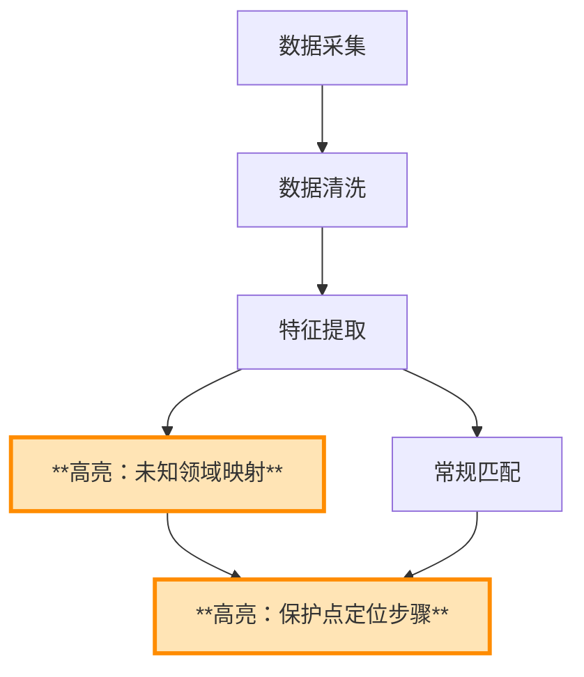

# 技术交底书生成模板（Step 7）

详细章节范例与 **mermaid** 图示模版见同目录 **`template_reference.md`**。

## 7.1 章节结构

由 **intake.md** Step 1 的 Q0「目标立案机构」决定走哪个分支：

- **A. 中移/集团/运营商立案** → 走下方「**中移 13 章制**」（参考中国移动集团 5 篇范文：XX2209082 大数据质量 / CMII2204017 室内定位 / CMII2203007 急诊分级 / HZYF2112012 视频封面 / MGSX2205129 足球数字人）
- **B. 通用/企业内审/快速申报** → 走下方「**通用 6 章制**」（保留历史默认行为）

---

### 分支 A：中移 13 章制（推荐给中移/集团/运营商场景）

```
0. 术语定义和解释（缩略语表，仅列专用缩写；例：LTE/RNC，引自 MGSX P2）
1. 注意事项
2. 一、发明名称（技术主题 + 申请类型，如「一种 XX 方法」/「一种 XX 装置」）
3. 二、技术领域（选最相关领域，**可多项并列**；如 CMII2204017 P1「室内定位、数据增强、混合深度学习模型、无线通信领域」4 项并列）
4. 三、现有技术的技术方案
   - 段首必铺场景（写作规范 1）
   - 按"第一/第二/第三"或"1)/2)/3)"列举现有专利（写作规范 2），每条 = 专利号 + 名称 + 技术方案 + 优劣
   - 使读者**逻辑自然推出**第四部分缺点（每篇范文分析反复强调）
5. 四、现有技术的缺点及本申请提案要解决的技术问题
   - 缺点**逐一对应**第三部分列举的现有专利（写作规范 3），句式："针对/对于 申请号为 X 的专利，[具体缺点]"
   - 本提案思路段（写作规范 4）— 此处先概述方案
6. 五、本申请提案的技术方案的详细阐述
   - **三层结构**（写作规范 5）：1) 方案概述 → 2) 方案的具体实现逻辑 → 2.x 子模块 → 步骤 1-N
   - 每步给具体业务实施例（写作规范 6）
   - 公式必给完整符号定义（写作规范 7，体例见 §7.7）
   - 步骤编号稳定可回指（写作规范 12）："步骤 1" / "步骤 S1" / "第一步" 三种风格通用
   - 流程图中**加粗/高亮重点步骤**（写作规范 13）
   - 末尾必重申本提案整体思路（写作规范 4 第二处）
7. 六、本申请提案的关键点和欲保护点
   - "编号 + 种字结构"句式（写作规范 8）："1、一种 ... 方法/装置/系统/模型/策略/方案/架构"
   - 按重要性递进（写作规范 9），标"主要/次要"
8. 七、与第三条中最接近的现有技术相比，本申请提案有何技术优点
   - **逐条对比最近似专利**（写作规范 10），点名 CN 号 + 解决其哪条缺点 + 取得何效果
9. 八、发散思维以及规避方案思考（可"无"）
10. 九、本申请提案的商业价值（跨平台适用性 + 市场前景）
11. 十、本申请提案的侵权证据可获得性（4 类手段：产品说明书 / 销售资料 / 源代码对比 / 运行结果）
12. 十一、其他有助于理解本申请提案的技术资料（关键术语解释 — 集团审核员关心此处）
13. 十二、本申请提案的项目信息（项目编号 + 项目名 + 与本提案的关联）
14. 十三、本申请提案的产品信息（可"无"）
15. **末：技术交底书撰写点评**（给出该领域撰写建议 + 流程图高亮重点步骤的提示）
```

#### 中移 13 章制典型范式指引

- **必两处出现本提案思路段**：第四部分末（"针对上述问题...本发明提出..."） + 第五部分开头（"本发明提出了一种..."）
- **每个关键步骤都给实施例**：从 5 篇范本看，每段步骤描述后立即跟"如因 XXX 业务场景"的具体例子（如 XX2209082 P8 乱码现象）
- **公式符号定义每条不能省**：模板句式"其中，xxx 为...含义为...量纲..."
- **关键点主要/次要的区分**：方法/系统/装置/模型（第 1-2 条），策略/方案/架构（后续）

---

### 分支 B：通用 6 章制（保留历史默认）

```
1. 注意事项
2. 一、介绍相关技术背景，描述与本发明技术最相近的现有技术，并说明该现有技术存在的缺点
   - 1.1 现有技术（按技术方向分类，含专利检索结果）
   - 1.2 现有技术存在的缺点
3. 二、针对上述缺点，说明本发明所要解决的技术问题
4. 三、本发明技术方案的详细阐述
   - 3.1 背景
   - 3.2 系统框图（**mermaid**，如 `flowchart` + `subgraph` 分层；交付前经工具转 PNG；**不要** ASCII 文字框图）
   - 3.3 模块功能说明（聚焦作用与关联关系，非输入输出）
   - 3.4 系统流程说明（**mermaid 流程图**，交付前经工具转 PNG；**不要** ASCII 文字/箭头流程图）
   - 3.4.1 符号与公式（出现公式或形式化变量时**须设**；**须**先符号与变量定义、再写公式；体例见 **§7.7** 与 **`template_reference.md` §3.4.1**）
   - 3.5 关键技术参数（参数表「符号」列与 3.4.1 **同形**）
5. 四、与现有技术相比，本发明具有哪些优点？
6. 五、本发明的技术关键点和欲保护点是什么？
7. 六、其它（实施例、技术效果、参数示例）
```

**第一章 1.1 撰写硬性要求**：在「按技术方向分类」的**每一条**现有技术（专利或文献）末尾或表格中，必须给出 **经核验的公开源 URL**（规范与示例见 `prior_art_search.md` 与 `template_reference.md` §1.1）。**国知局检索**（`EPUB_HITS_JSON`）中对该专利给出的 **`abstract` 非空时**：文中「技术方案 / 应用 / 局限」类表述**须以摘要理解为前提**（消化后重写，非整段粘贴），**禁止**与摘要明显矛盾或脱离摘要杜撰；详见 **`prior_art_search.md`**「`abstract` 必用」。

**禁止输出**：交底书正文中**不得**包含「自检清单」章节，例如检查项表格或带状态符号的清单列。自检见 `disclosure_self_check.md`，**内部执行**，不写入交付正文。

**禁止仓库/技能脚注**：交付用 Markdown **末尾不得**出现任何指向本技能或示例仓库的说明，例如「本文件为 `patent-disclosure-skill` 仓库内教学示例」「不构成任何法律或技术承诺」「虚构教学」「详见 `examples/`」等。正文**止于第六章及此前章节**；**不要**在文末追加斜体免责或仓库署名。

## 7.2 文档头部模板

```markdown
# 技术交底书

**案件名称**：[待填写]一种XXX方法及系统

**技术联系人**：
- 姓名：[待填写]
- 电话：[待填写]
- 邮箱：[待填写]

**专利类型**：发明

---

## 注意事项

（1）交底书应使代理人能看懂，尤其是背景技术和详细技术方案，一定要写得全面、清楚、完整；
（2）技术的公开程度，应以本领域普通技术人员不需付出创造性劳动即可进行实施为准。
（3）在与代理人沟通时，对于代理人咨询的技术问题，应给予回答并认真讲解，并且按要求及时正确地补充相应技术材料。
```

## 7.3 输出文件命名（用户产出目录，必遵循）

在用户目录（如 `outputs/{案件标识}/`）写入交底书 **Markdown / Word** 时，**主文件名须体现正文中的「案件名称」**，且**凡向用户落盘交付的定稿均须带时间戳后缀**（见下第 5 点），避免无区分度的固定名（如一律 `disclosure_draft.md`）。**仓库内 `examples/` 为教学统一可仍用固定名**；用户产出不适用该惯例。

1. **提取**：从 `**案件名称**：` 行取完整发明名称；去掉占位（如 `[待填写]`、`【待填写】`）、首尾空格。
2. **规范化**：删除或替换 Windows 非法字符 `\ / : * ? " < > |` 与换行；连续空格可压为单个空格或删去（中文标题通常无空格亦可）。
3. **长度**：文件名（不含扩展名）建议 **≤ 80 个字符**；超长则**截断**到约 80 字并保留语义完整（例如截在「方法及系统」等结尾词之前），勿用无意义随机串。
4. **定稿命令**：`mermaid_render.py` 的 `-o` / `--docx` 须使用**同一主文件名**，且该主名**必须符合第 5 点**（**案件名 + `_` + 14 位时间戳**）。示例（案件名已按上文规范化、过长已截断时）：

   `python3 tools/mermaid_render.py -i "…草稿.md" -o "一种异构计算环境下基于资源画像与限频重排队的批任务调度方法及系统_20260408143025.md"`

   默认同目录生成同名 `.docx`。过程性中间稿（仅自用、非交付）文件名可自定，但**最终交付**不得省略时间戳。

5. **时间戳后缀（凡落盘交付必遵循）**：凡写入用户产出目录、作为**向用户交付**的技术交底书 **`.md` / `.docx`**，主文件名须为：  
   **`{§7.3 规范化案件名}_{YYYYMMDDHHmmss}.md`** 与同名 **`.docx`**。  
   - **首次定稿**与**迭代合并/纠正**适用**同一规则**；每次交付取**当次落盘时**的**本地时间** 14 位数字（年月日时分秒各 2 位，如 `20260408143025`）。  
   - **不要覆盖**已有交付文件；新一次交付即**新时间戳**、新文件名。用户**明确要求**覆盖某路径时从其意。  
   - **`mermaid_render.py`** 的 `-o` 与可选 `--docx` 须与上述主名一致。  
   - **例外**：（1）仓库内 **`examples/`** 示例可继续固定文件名；（2）用户书面指定文件名时从其意（仍建议保留时间戳以免混淆）。

Agent **落盘时**即采用上述命名，并在回复中写明路径，便于用户对照标题与磁盘文件。

## 7.4 系统框图与流程图要点

- **系统框图与流程图**均仅用 **fenced mermaid**（本地 `mmdc` 渲染，不依赖外网 PlantUML）；Word 中以 PNG 为准，**无需**再附 ASCII 文字框图
- mermaid 内节点标签用简短中文/数字，避免 ①②③。可另写简短「流程说明」段落概括各步，**不得**用 ASCII 框线箭头代替图示

### 7.4.1 流程图高亮重点步骤（写作规范 13）

**摘自动步 5 篇范文末尾「技术交底书撰写点评」：** "对于方法流程中步骤较多的技术方案，发明人可以在方法流程中通过**高亮或加粗**的方式标注出发明人认为重点的几个步骤，便于更准确地确定发明保护点。"

mermaid 实现示例（重点节点用 `**文本**` 或 `classDef` 醒目标注）：



**要求**（中移 13 章分支下启用）：
- 流程步骤 ≥ 5 时，**必须**对至少 1 个步骤（核心创新点）加粗或高亮
- 加粗的步骤应与第六章「关键点和欲保护点」第 1-2 条（主要发明点）一一对应
- 不要全图加粗（失去重点意义）

## 7.5 脱敏要求

| 类型 | 脱敏方式 | 示例 |
|------|----------|------|
| 业务/行业 | 抽象为通用描述 | 「XX检测」→「多标签分类场景」 |
| 具体分类 | 用 ABC 等替代 | 「类别1、类别2」→「分类A、分类B、分类C」 |
| 具体数值 | 用范围或示例说明 | 「每日 N 人」→「每日一定规模」 |
| 公司/产品 | 不出现具体名称 | 删除或替换为「某系统」 |

## 7.7 符号与公式体例（必遵）

撰写 **3.4.1**、**3.5** 及全文含 LaTeX 的段落时须遵循；正/反例与符号表示例见 **`template_reference.md` §3.4.1**。

### 符号表先行

- 撰写 **3.4.1** 或全文含 LaTeX 时，**先写符号与变量定义**（可按（1）任务/对象下标、（2）节点/环境下标、（3）标量与向量分组），每项至少含：**符号、含义、下标含义（如 \(i\)=任务、\(j\)=节点）、量纲或取值范围**。
- 其后公式、**3.5 参数表**、**第六章实施例**中出现的符号须与符号表 **同形、同义**。
- **禁止同一字母多义**：例如任务侧权重用 \(b\)，节点侧饱和度应改用 \(g\)、\(h\) 等其它字母，勿任务/节点共用 \(b\) 表示不同物理量。

### 下标与上标

- **资源维度/类型标签**（cpu、mem、io、peak 等）一律写入 **下标**，维度名用 `\mathrm{cpu}`、`\mathrm{mem}` 等正体，例如 `b_{i,\mathrm{cpu}}`、`a_{j,\mathrm{mem}}`。
- **禁止**用 `^{cpu}`、`^{mem}`、`^{io}` 等 **上标** 表示维度或字段名（易被读作幂次，亦不符合专利正文常见写法）。
- **上标仅用于**：幂次、转置、序号、撇号类标记；**下标用于**对象编号与维度标签。

### LaTeX 分隔与写法（全文统一）

- **行内公式**：全文统一 **`\(...\)`** 或 **`$...$`** 二选一，**不得混用**。
- **块级公式**：全文统一 **`\[...\]`** 或 **`$$...$$`** 二选一，**不得混用**。
- 比较符优先写 `\leq`、`\geq`（定稿工具可兼容 `\le`/`\ge`，正文仍推荐 `\leq`/`\geq`）。
- 块级公式尽量 **单行写完**；需编号时用 `\tag{1}` 或正文写「式 (1)」，**全文择一**并保持体例一致。
- 逻辑连接词（「且」「或」）优先写在公式 **外** 的中文叙述中；若必须写入公式内，用 `\land`/`\lor`，**避免** `\text{且}` 等复杂文本命令（定稿渲染易失败）。

### 跨节一致

- **3.4.1 符号表**、正文首次定义式、**3.5「符号」列**、**第六章实施例** 四处须 **逐字同形**。
- 修改任一处符号时，须同步核对上述各处及 3.3/3.4 文字叙述中的同名变量。

---

## 7.8 范文学习索引（13 条写作规范出处）

本 skill 提炼自中国移动集团 5 篇成功专利交底书范文，老大 2026-07-14 学过的规范：

| 领域 | 编号 | 页数 | 重点学到 |
|------|------|------|---------|
| 云计算大数据 | XX2209082 提高大数据系统的基础数据质量的方法 | 16 | 第三部分"第一/第二/第三"专利列举 / 发明点 3 条按重要性递进 / 步骤 1-5 + 实施例 |
| 位置领域 | CMII2204017 CNN 指纹匹配室内定位 | 8 | 双研究方向优劣对比 / 3.2 公式 + 完整符号定义 / 多特征数据表格 |
| 垂直领域（医疗） | CMII2203007 基于深度学习的急诊分级 | 17 | **3.3 关键点 6 条"种字结构"典范** / 1.1 三专利对比 / 第七部分点名 CN110874409A 最近似 |
| 视频领域 | HZYF2112012 多维度语义视频动态封面 | 15 | "S1-S5" 步骤编号 / 多检测子模块可拆卸 / 迁移学习 CLIP + 公式 |
| 视频领域 | MGSX2205129 稀疏多视角足球比赛数字人 | 11 | 含零章术语表 / SMPL 模型 6890 顶点详解 / 三种边 ε_P/ε_V/ε_T |

**被剔的 1 篇：** GD2208034 身份证翻拍（10 页）— 老大明确指令乱码的文章直接删掉。P1-3 章节标题"一、发发发"乱码、P9 末"项目/产品"整页乱码。

**13 条用户产出规范表：**

| 规范 | 描述 | 出处页码 |
|:----:|------|---------|
| 1 | 段首必铺场景 | 全部 5 篇每章开头 |
| 2 | 现有技术用"第一/第二/第三"或"1)/2)/3)"列举 | XX2209082 P1-2、HZYF2112012 P2-3 |
| 3 | 缺点"逐一对应"现有专利 | XX2209082 P3、CMII2203007 P2 |
| 4 | 本提案思路段两处出现（第四末 + 第五头） | 全部 5 篇 |
| 5 | 技术方案三层结构（概述→逻辑→子模块→步骤） | XX2209082 P4-5 |
| 6 | 每步给业务实施例 | XX2209082 P8 乱码例子、CMII2204017 P4 |
| 7 | 公式完整符号定义（含义/下标/量纲） | XX2209082 P9、CMII2204017 P3 |
| 8 | 关键点"种字结构"（方法/装置/系统/模型/策略/方案/架构） | CMII2203007 P15 |
| 9 | 关键点按重要性递进，标主次 | 全部 5 篇范文分析原话 |
| 10 | 技术优点"点名 CN 号逐条对比最近似专利" | CMII2203007 P17、HZYF2112012 P13 |
| 11 | 术语表仅列专用缩写 | MGSX P2 |
| 12 | 步骤编号稳定可回指（步骤 1/S1/第一步） | 全部 5 篇 |
| 13 | 流程图高亮/加粗重点步骤 + 末点评 | 全部 5 篇末「撰写点评」 |

---

## 定稿交付：Markdown + Word（必做）

**版本与覆盖**：凡交付均以 **§7.3 第 5 点**「**案件名 + 时间戳**」落盘，同目录下多文件即版本历史。**可选**：另存 `versions/` 手工快照非强制。

须**同时**交付：

1. **Markdown**：定稿 `.md` **保留** `` ```mermaid`` 围栏源码，并含 ``<!--  -->`` 注释引用（由 `mermaid_render.py` 生成）。
2. **Word**：对上一文件执行 `md_to_docx.py`，或使用一条命令：

`python3 tools/mermaid_render.py -i <含图示的草稿.md> -o "<案件名_YYYYMMDDHHmmss>.md"`（默认在同目录生成**同名** `.docx`；可用 `--docx` 指定路径，`--no-docx` 跳过 Word。Word 失败时见终端提示的手动命令。）

（mermaid 依赖 Node/mmdc、`pip install -r requirements.txt` 见 `tools/README.md`。）

## 7.6 交付回复：权利要求偏向点（建议交互，必做）

每次向用户**交付**本技能产出的定稿（已写明 **`{案件名}_{YYYYMMDDHHmmss}.md` / `.docx` 路径**）时，在**同一条对话回复**中**追加**一段**仅供用户选用**的交互引导（**不得**写入交底书正文、不得出现在 `.md`/`.docx` 内）。

**须交代清楚：**

1. 用户若希望对**第五章「技术关键点和欲保护点」**做更贴近**权利要求书撰写习惯**的强化，可**用一句话说明侧重点**。  
2. 承接方式：Agent **`Read`** **`iteration_context.md`**，再按 **`merger.md`** 以**当前交付稿为基准**合并，**另存**新时间戳 **`.md` / `.docx`**（§7.3 第 5 点），并维护 **`交底书修订对话记录.md`**。  
3. **禁止捏造偏向**：对话里提出的「可对举的两类侧重点」**必须**能从**当前定稿与上游已用材料**中推出——包括 Step 2 扫描文档、Step 3–4 已整理专利点、**第三至五章已写明的技术方案与保护点表述**；**不得**为了凑交互而编造本案未涉及的场景、模块或行业词。若全文仅有一条清晰保护主线，**只须忠实概括该主线**并询问是否改为更「方法/系统/流程步骤」或更「装置/模块」等**书式侧重**（仍须对应文中已有结构，不新增技术事实）。  
4. 在满足上条前提下，可给出**两组可对举的偏向**（用语须**摘编或概括**自正文已有概念，而非套用泛例）；句式可参考：

> 若您希望权利要求/保护点表述更偏「……」或更偏「……」（**二者均须与本稿已阐述的技术路线或保护点一致，仅为书式或强调重心之择**），请说明侧重点；我可按 **`iteration_context.md`** 与 **`merger.md`** 另存一版，对**第五章做权利要求书式强化**（无新材料时其它章节以衔接一致为前提，尽量保持既有结论）。

**合并 / 纠正迭代**若再次交付定稿，**仍须**附带本节同类引导（可缩短为 1～2 句，但须保留「第五章」「新时间戳」「iteration_context + merger」三要素之一或等效说明，且**仍遵守「不捏造」**）。
